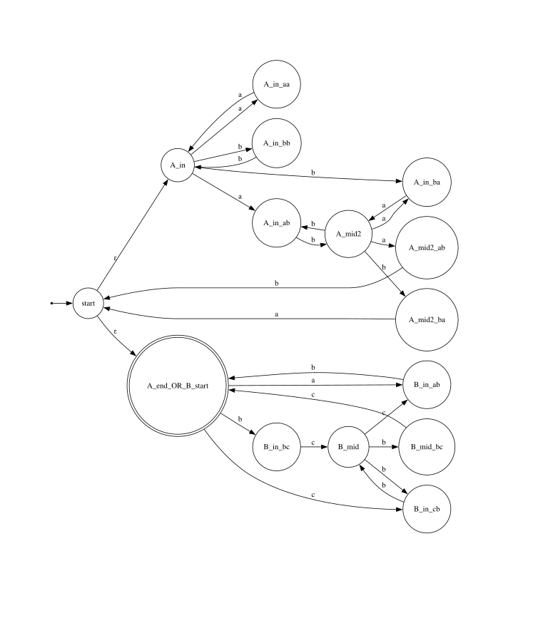
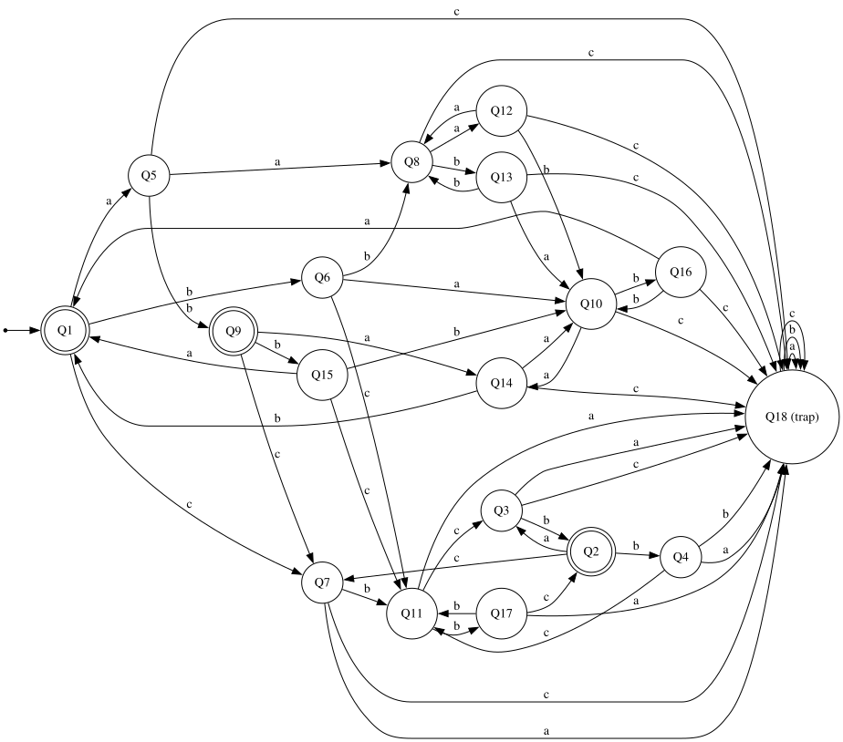
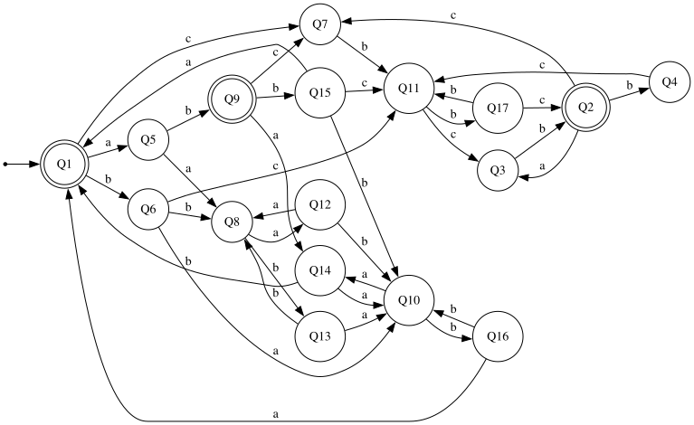
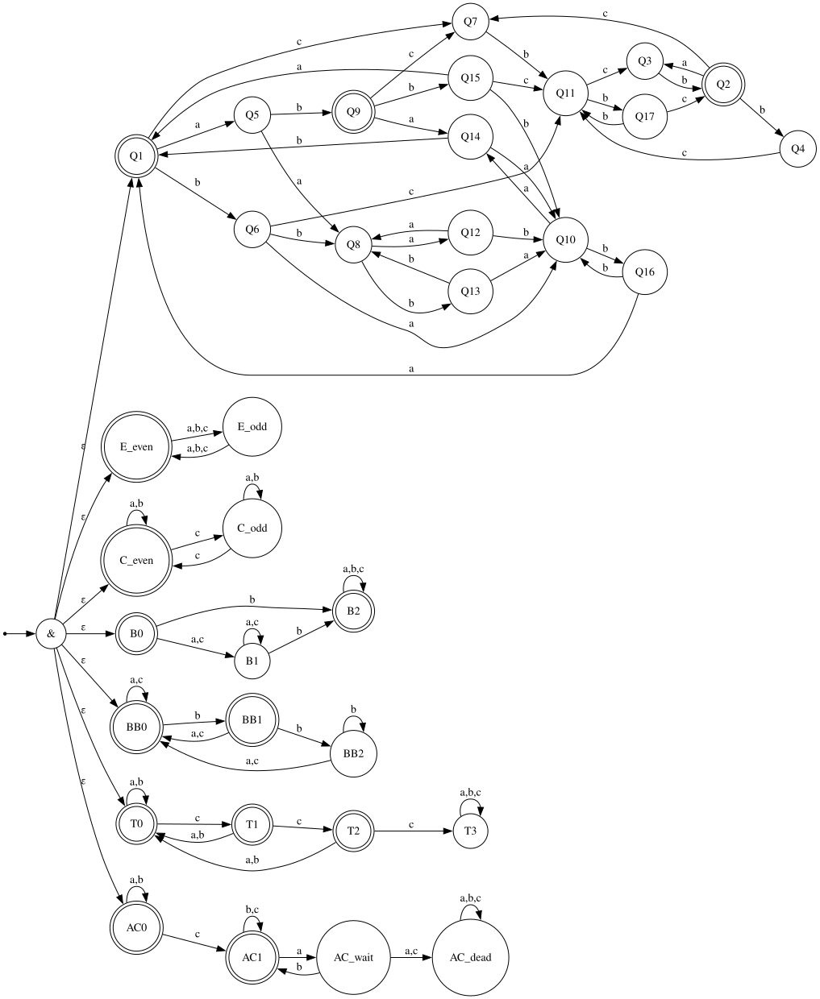

# Анализ регулярного языка

Регулярное выражение:

`((aa|bb)*(ab|ba)(aa|bb)*(ab|ba))*(ab|(bc|cb)(bb)*(cb|bc))*`

---

## НКА

НКА лежит в [`graphviz/nka.dot`](graphviz/nka.dot).

Граф НКА:



Таблица:

| prefix | ε | b | a | aab | ab | bc | c | bbc | abab | bab | cbc |
| --------------- | - | - | - | --- | -- | -- | - | --- | ---- | --- | --- |
| **ε**           | 1 | 0 | 0 | 0   | 1  | 0  | 0 | 0   | 1    | 0   | 0   |
| **a**           | 0 | 1 | 0 | 0   | 0  | 0  | 0 | 0   | 0    | 1   | 0   |
| **abb**         | 0 | 0 | 1 | 1   | 0  | 0  | 0 | 0   | 0    | 1   | 1   |
| **b**           | 0 | 0 | 0 | 1   | 0  | 0  | 0 | 0   | 0    | 0   | 1   |
| **ba**          | 0 | 0 | 0 | 0   | 1  | 0  | 0 | 0   | 1    | 0   | 0   |
| **bc**          | 0 | 0 | 0 | 0   | 0  | 1  | 0 | 0   | 0    | 0   | 0   |
| **bcb**         | 0 | 0 | 0 | 0   | 0  | 0  | 1 | 1   | 0    | 0   | 0   |
| **c**           | 0 | 0 | 0 | 0   | 0  | 0  | 0 | 1   | 0    | 0   | 0   |
| **aa**          | 0 | 0 | 0 | 0   | 0  | 0  | 0 | 0   | 1    | 0   | 0   |
| **aaa**         | 0 | 0 | 0 | 0   | 0  | 0  | 0 | 0   | 0    | 1   | 0   |
| **bcbcb**       | 0 | 0 | 0 | 0   | 0  | 0  | 0 | 0   | 0    | 0   | 1   |

---

## ДКА

Минимальный ДКА лежит в [`graphviz/dka_min.dot`](graphviz/dka_min.dot)
Более полный вариант с состоянием-ловушкой — в [`graphviz/dka_min_trap.dot`](graphviz/dka_min_trap.dot).

Граф ДКА с ловушкой:



Граф ДКА без ловушки:



Таблица:

| state  | prefix | abba | ε | ba | b | bba | aab | bbc | bc | cbc | c |
| ------ | ------------- | ---- | - | -- | - | --- | --- | --- | -- | --- | - |
| q1     | **ε**             | 1    | 1 | 0  | 0 | 0   | 0   | 0   | 0  | 0   | 0 |
| q2     | **bcbc**          | 0    | 1 | 0  | 0 | 0   | 0   | 0   | 0  | 0   | 0 |
| q3     | **bcc**           | 0    | 0 | 0  | 1 | 0   | 0   | 0   | 0  | 0   | 0 |
| q4     | **bcbcb**         | 0    | 0 | 0  | 0 | 0   | 0   | 0   | 0  | 1   | 0 |
| q5     | **a**             | 0    | 0 | 0  | 1 | 1   | 0   | 0   | 0  | 0   | 0 |
| q6     | **b**             | 0    | 0 | 0  | 0 | 0   | 1   | 0   | 0  | 1   | 0 |
| q7     | **c**             | 0    | 0 | 0  | 0 | 0   | 0   | 1   | 0  | 0   | 0 |
| q8     | **aa**            | 1    | 0 | 0  | 0 | 0   | 0   | 0   | 0  | 0   | 0 |
| q9     | **ab**            | 0    | 1 | 1  | 0 | 0   | 0   | 0   | 0  | 0   | 0 |
| q10    | **ba**            | 0    | 0 | 1  | 0 | 0   | 0   | 0   | 0  | 0   | 0 |
| q11    | **bc**            | 0    | 0 | 0  | 0 | 0   | 0   | 0   | 1  | 0   | 0 |
| q12    | **aaa**           | 0    | 0 | 0  | 0 | 1   | 0   | 0   | 0  | 0   | 0 |
| q13    | **aab**           | 0    | 0 | 0  | 0 | 0   | 1   | 0   | 0  | 0   | 0 |
| q14    | **aba**           | 0    | 0 | 0  | 1 | 0   | 1   | 0   | 0  | 0   | 0 |
| q15    | **abb**           | 0    | 0 | 0  | 0 | 1   | 1   | 0   | 0  | 1   | 0 |
| q16    | **bab**           | 0    | 0 | 0  | 0 | 1   | 1   | 0   | 0  | 0   | 0 |
| q17    | **bcb**           | 0    | 0 | 0  | 0 | 0   | 0   | 1   | 0  | 0   | 1 |
| q_dead | **ac**            | 0    | 0 | 0  | 0 | 0   | 0   | 0   | 0  | 0   | 0 |

---

## ПКА

ПКА лежит в [`graphviz/pka.dot`](graphviz/pka.dot).

Граф ПКА:



Таблица:

| prefix | ε | cbc | a | bba | bab | aabab | babab |
| --------------- | - | --- | - | --- | --- | ----- | ----- |
| **abb**         | 0 | 1   | 1 | 1   | 1   | 1     | 1     |
| **bab**         | 0 | 0   | 1 | 1   | 1   | 1     | 1     |
| **a**           | 0 | 0   | 0 | 1   | 1   | 1     | 1     |
| **aba**         | 0 | 0   | 0 | 0   | 1   | 1     | 1     |
| **b**           | 0 | 1   | 0 | 0   | 0   | 1     | 1     |
| **bcc**         | 0 | 0   | 0 | 0   | 1   | 0     | 1     |
| **ε**           | 1 | 0   | 0 | 0   | 0   | 0     | 0     |

---

## Расширенная регулярка

**Академическая регулярка**

`((aa|bb)*(ab|ba)(aa|bb)*(ab|ba))*(ab|(bc|cb)(bb)*(cb|bc))*`

**Расширенная регулярка**

```regex
^(
  (
    ((aa|bb)+)?
    ((?=(ab|ba))..)
    ((aa|bb)+)?
    ((?=(ab|ba))..)
  )+
)?(
  (
    ((?=ab)..)
    |
    ( ((?=(bc|cb))..) ((bb)+)? ((?=(bc|cb))..) )
  )+
)?$
````

* Одинаковая внешняя структура: в обоих выражениях сначала идёт блок с чередованием `ab`/`ba` и возможными вставками из `aa`/`bb`, затем хвостовой блок `ab` или `(bc|cb)(bb)*(cb|bc)`.
* Замена `(aa|bb)*` на `((aa|bb)+)?`: `+` даёт непустую последовательность из `aa`/`bb`, `?` разрешает пустой вариант, поэтому множества слов совпадают.
* Замена `ab`, `ba`, `bc`, `cb` на конструкции с lookahead и `..`: `((?=ab)..)` и аналоги читают ровно две буквы, а lookahead проверяет, что это нужная пара, так что они эквивалентны исходным подвыражениям.
* Структура повторений сохраняется: внутренние `(...)+` в расширенной записи реализуют те же самые возможные последовательности фрагментов, которые задаются звёздочками в академической регулярке, поэтому возможные слова и порядок повторений совпадают.

---

## Fuzz-тестирование

Код для fuzz-тестирования лежит в [`fuzz/src/bin/fuzz_test.rs`](fuzz/src/bin/fuzz_test.rs).
